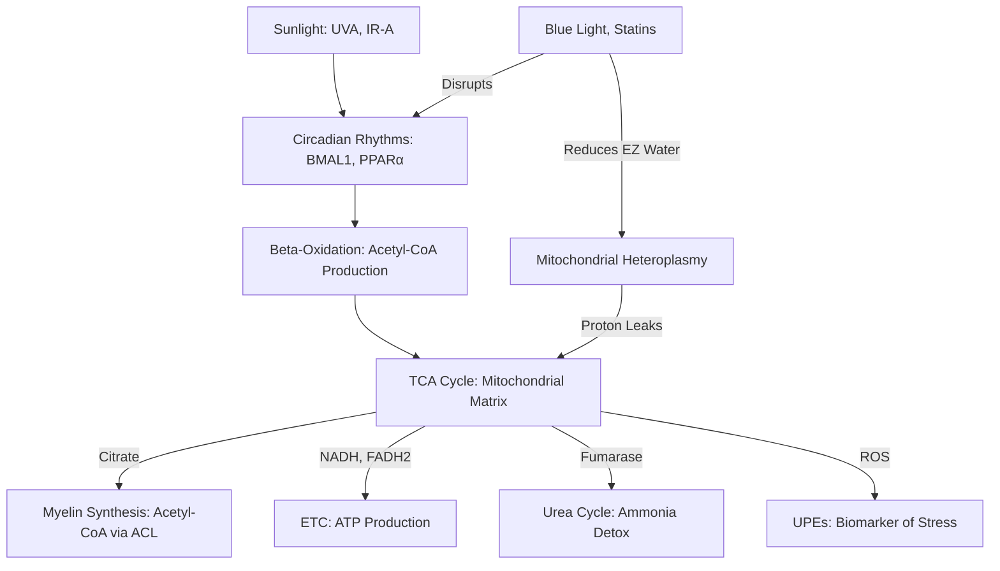
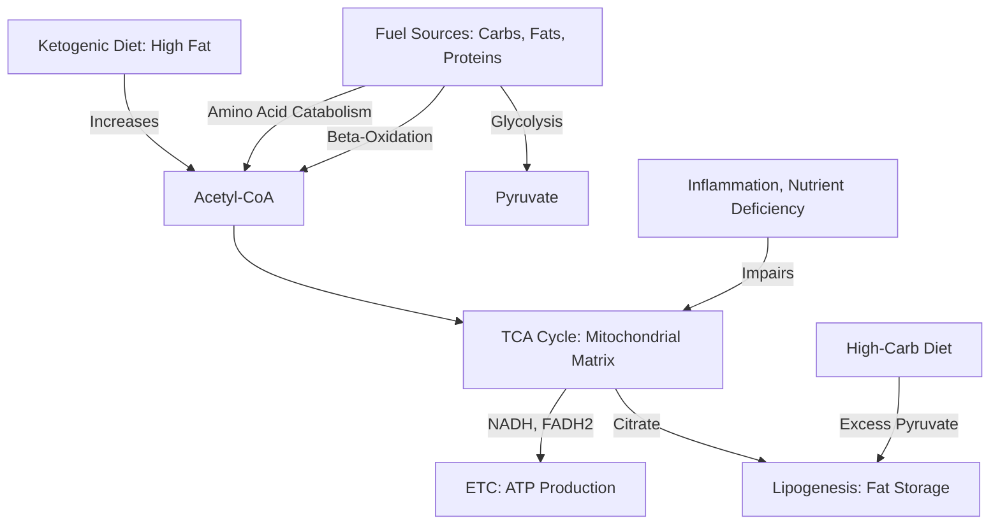
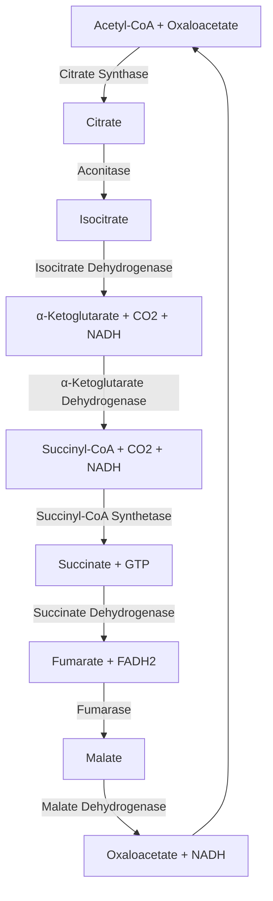

---
aliases:
  - Krebs Cycle
  - tricarboxylic acid cycle
  - citric acid cycle
tags:
  - TCA-cycle
  - Cellular-Metabolism
  - Acetyl-CoA
  - Citrate-Synthesis
  - Myelin
  - beta-oxidation
  - Glycolysis
  - Mitochondrial-Energy
  - Circadian-Rhythm
  - sunlight-exposure
---
The tricarboxylic acid (TCA) cycle, also known as the Krebs or citric acid cycle, is a central metabolic pathway in mitochondria that oxidizes acetyl-CoA to produce energy (ATP), reducing equivalents (NADH, FADH2), and biosynthetic precursors. While traditional biochemistry views the TCA cycle as a series of enzyme-driven reactions, [[Jack Kruse, MD|Jack Kruse]] and Bart Kay, known for their unconventional perspectives, integrate biophysics, environmental factors, and metabolic kinetics into their explanations.

## Jack Kruse’s Perspective on the TCA Cycle

Jack Kruse, a neurosurgeon and biohacker, approaches the TCA cycle through a quantum biology lens, emphasizing the role of light, water, and mitochondrial biophysics in metabolic efficiency. He argues that the TCA cycle’s function is deeply tied to environmental inputs, particularly sunlight, and its interaction with mitochondrial redox potential and water chemistry. His perspective, often shared on his blog (e.g., jackkruse.com) and forums, challenges conventional views by focusing on the TCA cycle’s integration with the urea cycle at the “Krebs bicycle” and the impact of circadian mismatches.

### Key Points of Kruse’s TCA Cycle Explanation

#### 1. Sunlight and Circadian Regulation:

- Kruse emphasizes that morning sunlight (particularly UVA and IR-A wavelengths) entrains circadian rhythms via the suprachiasmatic nucleus (SCN), regulating clock genes like BMAL1 and PPARα. These genes enhance beta-oxidation, providing acetyl-CoA to the TCA cycle. Without sunlight, beta-oxidation is impaired, reducing TCA cycle flux and citrate production for biosynthetic processes like [[Myelin]] synthesis.

- He argues that sunlight structures water in the mitochondrial matrix into an [[exclusion zone]] (EZ), a gel-like state that enhances electron and proton tunneling in the TCA cycle and electron transport chain (ETC). This improves energy efficiency. Lack of sunlight disrupts this water structure, lowering redox potential and TCA cycle efficiency.
        
#### 2. Krebs Bicycle and Urea Cycle Integration:
    
- Kruse introduces the “Krebs bicycle,” where the TCA and urea cycles intersect via the enzyme fumarase, which adds water to both cycles. This integration is critical for detoxifying ammonia (via the urea cycle) and maintaining TCA cycle kinetics. Disruptions (e.g., from statins or blue light exposure) slow urea cycle kinetics, reducing TCA cycle flux and impairing beta-oxidation.
        
  - He suggests that mitochondrial heteroplasmy (variability in mtDNA) and poor water structuring (due to lack of IR-A light) cause proton leaks, reducing TCA cycle efficiency and leading to reliance on glycolysis or the pentose phosphate pathway (PPP).
        
#### 3. Warburg Redox Shift and TCA Cycle Dysfunction:
    
 - Kruse links TCA cycle dysfunction to the Warburg effect, where cells favor glycolysis over OXPHOS due to pseudohypoxia (perceived oxygen deficiency). This shift, driven by circadian mismatches (e.g., blue light exposure), disrupts TCA cycle kinetics, forcing cells to rely on glycolysis and PPP for biosynthesis. This is particularly relevant in cancer and metabolic diseases.
        
- He argues that chronic pseudohypoxia alters proton dynamics at the Krebs bicycle, inhibiting TCA cycle enzymes and increasing ROS, which can be measured as ultraweak photon emissions (UPEs).
        
#### 4. Environmental and Biophysical Impacts:
    
- Kruse stresses that artificial blue light (e.g., from screens) disrupts opsins and vitamin A recycling, lowering mitochondrial redox potential and TCA cycle efficiency. This leads to a “leaky” mitochondrial matrix, where water’s hydrogen-bonding network fails to support efficient proton tunneling.
        
 - He also critiques statins, which inhibit HMG-CoA reductase, slowing urea cycle kinetics and indirectly impairing TCA cycle flux by limiting beta-oxidation. This exacerbates metabolic disorders like type 2 diabetes.
        

##### Diagram: Kruse’s TCA Cycle with Biophysical Context

_Caption: Kruse’s view integrates sunlight-driven circadian regulation with TCA cycle function, emphasizing water structuring ([[Exclusion Zone Water|EZ]]) and urea cycle linkage (Krebs bicycle). Disruptions (blue light, statins) impair beta-oxidation and proton dynamics, reducing TCA cycle efficiency and increasing ROS/UPEs._

---

## Bart Kay’s Perspective on the TCA Cycle

Bart Kay, a nutrition and physiology expert, focuses on the TCA cycle from a practical, low-carb, ketogenic perspective, often critiquing mainstream nutritional science. His views, expressed in YouTube videos and interviews, emphasize the TCA cycle’s role in energy production from fats and proteins over carbohydrates, aligning with his advocacy for carnivore or ketogenic diets.

### Key Points of Kay’s TCA Cycle Explanation

#### 1. Fuel Sources and Acetyl-CoA:
    
- Kay stresses that the TCA cycle is a universal pathway for oxidizing acetyl-CoA from carbohydrates (via glycolysis), fats (via beta-oxidation), and proteins (via amino acid catabolism). In a ketogenic state, beta-oxidation of fatty acids becomes the primary source of acetyl-CoA, making the TCA cycle central to fat-burning metabolism.
        
- He argues that reliance on glucose (via glycolysis) is less efficient and unnecessary for most tissues, as fats provide a steadier supply of acetyl-CoA, producing more NADH and FADH2 per cycle for ATP synthesis.
        
#### 2. Regulation and Efficiency:
    
 - Kay highlights the TCA cycle’s regulation by substrate availability (e.g., acetyl-CoA, oxaloacetate) and energy demand (ADP/ATP ratio). In a ketogenic diet, high fat availability ensures ample acetyl-CoA, while ketone bodies (e.g., beta-hydroxybutyrate) can bypass glycolysis, supporting TCA cycle flux.
        
- He critiques high-carb diets for causing TCA cycle overload (excess acetyl-CoA from pyruvate), leading to fat storage via citrate export and lipogenesis, which he sees as a driver of obesity and metabolic dysfunction.
        
#### 3. Mitochondrial Health:
    
- Kay emphasizes that mitochondrial health is critical for TCA cycle efficiency. Chronic inflammation, oxidative stress, or nutrient deficiencies (e.g., thiamine for pyruvate dehydrogenase) impair TCA cycle enzymes, reducing ATP production and increasing ROS.
        
- He advocates for minimizing processed carbs and seed oils, which he claims disrupt mitochondrial membranes and TCA cycle function, favoring a carnivore diet to optimize fat metabolism.
        
#### 4. Practical Implications:
    
- Kay argues that the TCA cycle’s efficiency in ketosis supports sustained energy production without blood sugar spikes, reducing metabolic stress. He dismisses the need for dietary carbs, as gluconeogenesis and ketogenesis provide sufficient substrates for the TCA cycle and other pathways.
        
- He critiques mainstream science for overemphasizing glycolysis and underplaying the TCA cycle’s role in fat metabolism, which he sees as evolutionarily optimal.
        

##### Diagram: Kay’s TCA Cycle with Ketogenic Context

_Caption: Kay’s view emphasizes the TCA cycle’s role in oxidizing acetyl-CoA from fats in a ketogenic state, minimizing reliance on glucose. High-carb diets overload the cycle, promoting lipogenesis, while inflammation impairs mitochondrial function._

---

## Standard Biochemical Overview of the TCA Cycle (for Context)

To provide a complete picture, here’s a concise summary of the TCA cycle’s biochemical steps, which Kruse and Kay build upon:

1. Citrate Formation: Acetyl-CoA combines with oxaloacetate to form citrate (6C), catalyzed by citrate synthase.
    
2. Isocitrate Formation: Citrate is isomerized to isocitrate by aconitase.
    
3. Isocitrate to α-Ketoglutarate: Isocitrate is oxidized and decarboxylated to α-ketoglutarate (5C), producing CO2 and NADH, catalyzed by isocitrate dehydrogenase.
    
4. α-Ketoglutarate to Succinyl-CoA: α-Ketoglutarate is oxidized and decarboxylated to succinyl-CoA (4C), producing CO2 and NADH, catalyzed by the α-ketoglutarate dehydrogenase complex.
    
5. Succinyl-CoA to Succinate: Succinyl-CoA is converted to succinate, producing GTP (convertible to ATP), catalyzed by succinyl-CoA synthetase.
    
6. Succinate to Fumarate: Succinate is oxidized to fumarate, producing FADH2, catalyzed by succinate dehydrogenase.
    
7. Fumarate to Malate: Fumarate is hydrated to malate by fumarase.
    
8. Malate to Oxaloacetate: Malate is oxidized to oxaloacetate, producing NADH, catalyzed by malate dehydrogenase.
    

Products per Acetyl-CoA: 2 CO2, 3 NADH, 1 FADH2, 1 GTP (ATP equivalent). Each glucose molecule (yielding 2 pyruvate and 2 acetyl-CoA) powers two TCA cycles, doubling the output.

### Regulation:

- Enzymes: Citrate synthase, isocitrate dehydrogenase, and α-ketoglutarate dehydrogenase are key control points, regulated by substrate availability (acetyl-CoA, oxaloacetate), product inhibition (NADH, citrate), and allosteric modulators (Ca2+, ADP).
    
- Cofactors: Requires NAD+, FAD, and coenzyme A; deficiencies (e.g., thiamine for α-ketoglutarate dehydrogenase) impair function.
    

#### Diagram: Standard TCA Cycle

_Caption: The TCA cycle oxidizes acetyl-CoA to CO2, producing NADH, FADH2, and GTP for ATP synthesis via the ETC. It regenerates oxaloacetate in a closed loop._

---

## Comparison and Integration of Kruse and Kay’s Views

- ### Common Ground:
    
    - Both emphasize the TCA cycle’s role as a metabolic hub for fat metabolism, with Kruse focusing on beta-oxidation’s dependence on sunlight and Kay on its optimization in ketosis.
        
    - Both critique mainstream approaches: Kruse targets environmental disruptors (blue light, statins), while Kay criticizes high-carb diets and processed foods.
        
    - Both stress mitochondrial health as critical for TCA cycle efficiency, linking dysfunction to metabolic diseases.
        
- ### Differences:
    
    - Kruse’s Biophysical Focus: Kruse integrates quantum biology, emphasizing light-driven water structuring, proton dynamics, and UPEs as biomarkers of TCA cycle function. His “Krebs bicycle” concept ties the TCA cycle to urea cycle kinetics, a perspective absent in Kay’s work.
        
    - Kay’s Practical Focus: Kay focuses on dietary optimization (ketogenic/carnivore diets) to maximize TCA cycle efficiency via fat-derived acetyl-CoA, with less emphasis on biophysics or environmental factors like light.
        
    - Scope: Kruse’s view is broader, linking TCA cycle dysfunction to cancer, neuropathy, and demyelinating diseases via circadian and redox mechanisms. Kay’s view is narrower, focusing on metabolic health and obesity prevention through diet.
        
- ### Relevance to Original Query:
    
    - Kruse directly addresses the original question’s focus on sunlight’s role in TCA cycle dynamics and myelin synthesis, linking circadian disruption to impaired beta-oxidation and citrate production. His emphasis on UPEs and mtDNA metabolism aligns with the query’s biophysical framework.
        
    - Kay’s perspective indirectly supports the query by highlighting beta-oxidation’s role in providing acetyl-CoA for the TCA cycle, which could support myelin synthesis in a ketogenic context. However, he does not address sunlight, UPEs, or demyelinating diseases explicitly.
        

---

## Implications for how TCA cycle dynamics fit into myelin synthesis

The original query asked how TCA cycle dynamics fit into myelin synthesis, mtDNA metabolism, UPEs, and demyelinating diseases, with sunlight as a critical factor. Integrating Kruse’s and Kay’s perspectives:

- Sunlight and TCA Cycle (Kruse): Morning sunlight drives beta-oxidation via circadian genes, ensuring acetyl-CoA and citrate availability for myelin synthesis. Without sunlight, TCA cycle flux slows, impairing oligodendrocyte (CNS) and Schwann cell (PNS) function, exacerbating demyelination.
    
- Ketogenic Support (Kay): A ketogenic diet enhances beta-oxidation, providing acetyl-CoA to the TCA cycle, potentially compensating for circadian disruptions by ensuring citrate for myelin synthesis. This is particularly relevant for PNS repair, where Schwann cells are metabolically flexible.
    
- mtDNA Metabolism and UPEs (Kruse): TCA cycle-driven OXPHOS supports mtDNA metabolism, but circadian or dietary disruptions increase mitochondrial stress, elevating ROS and UPEs, especially in CNS nodes with limited repair capacity.
    
- Rosetta Stone: Kruse’s framework unifies sunlight, TCA cycle kinetics, and UPEs, while Kay’s dietary focus complements it by optimizing fuel inputs. Together, they suggest that circadian alignment (sunlight) and ketogenic metabolism (fat-based acetyl-CoA) could restore TCA cycle function, supporting myelin repair and reducing UPEs as a biomarker of recovery.
    

---

## Conclusion

Jack Kruse views the TCA cycle as a biophysical process modulated by sunlight, water structuring, and urea cycle integration, with disruptions (e.g., blue light, statins) causing metabolic dysfunction and increased UPEs. Bart Kay sees it as a metabolic hub optimized by ketogenic diets, emphasizing fat-derived acetyl-CoA for efficient energy production. Both perspectives highlight the TCA cycle’s role in supporting myelin synthesis and mitochondrial health, with Kruse providing a direct link to sunlight and UPEs, and Kay offering practical dietary strategies.