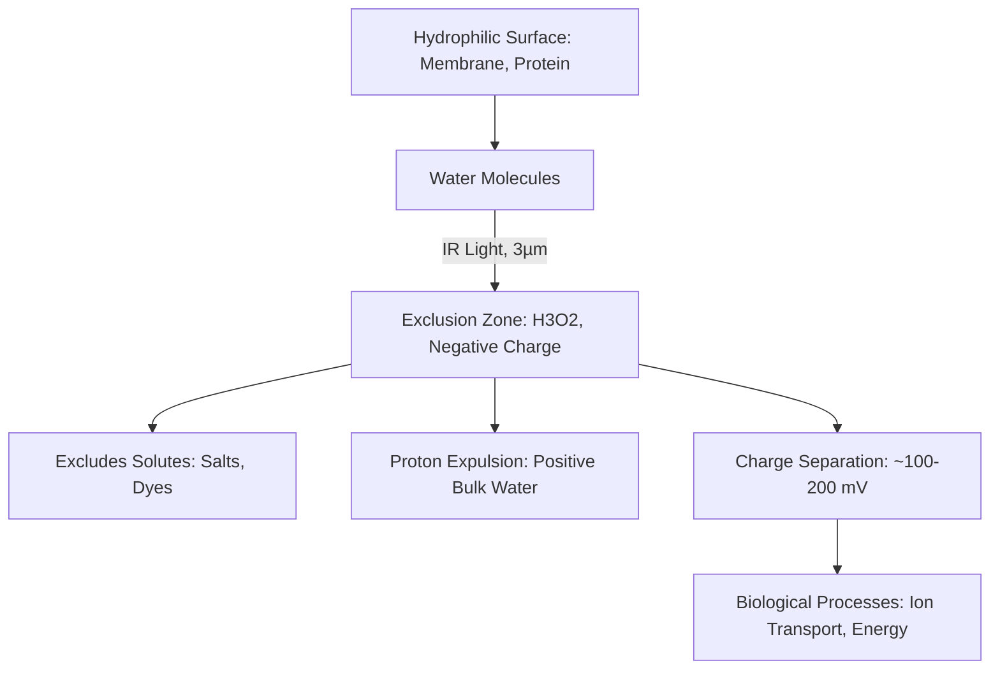
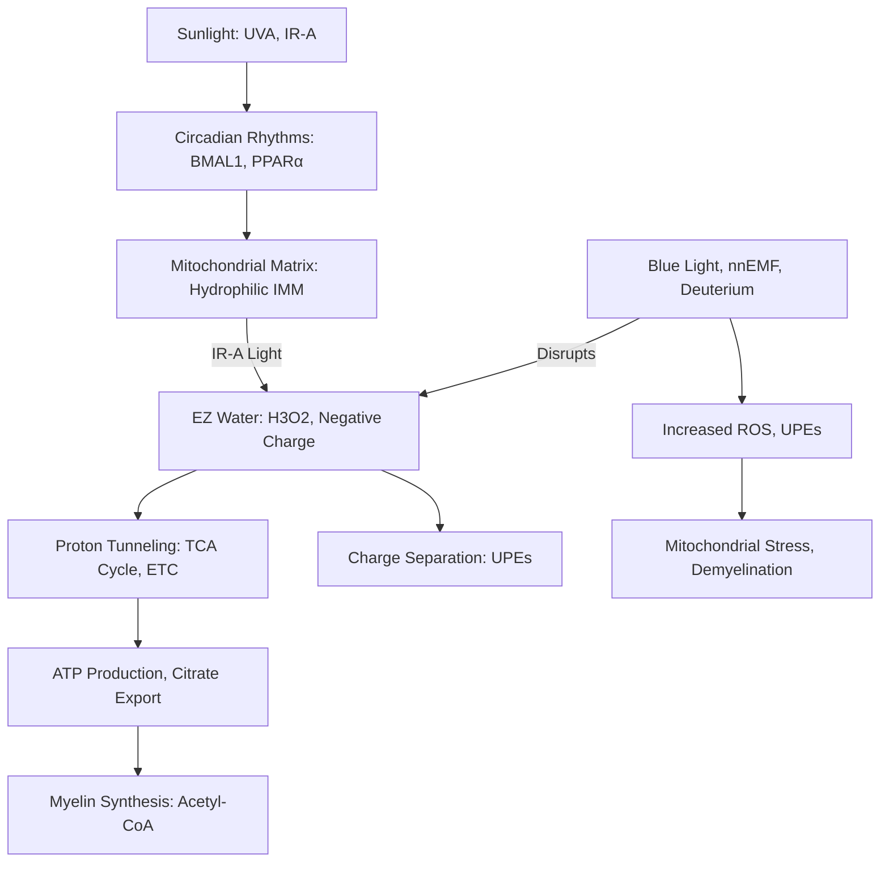

---
aliases:
  - EZ
  - Fourth Phase of Water
  - 4th phase of water
  - EZ Water
  - exclusion zone
tags:
  - EZ-Water
  - EZ-Water
  - EZ-Water
  - Gerald-Pollack
  - Jack-Kruse
  - Mitochondrial-function
  - TCA-cycle
  - Circadian-Rhythm
  - sunlight-exposure
  - proton-tunneling
  - ultraweak-photon-emissions
  - Myelin
  - Demyelination
  - charge-separation
  - infrared-light
  - Quantum-Biology
  - mitochondrial-matrix
  - beta-oxidation
  - ROS
  - nnEMF
  - deuterium
---
The concept of the fourth phase of water, also known as exclusion zone (EZ) water, was introduced by [[Gerald Pollack]], a bioengineering professor, and has been expanded upon by [[Jack Kruse, MD|Jack Kruse]], a neurosurgeon and biohacker, to explain its role in biological systems. This phase of water, distinct from liquid, solid, and gas, is a structured, gel-like state that forms near hydrophilic surfaces and is influenced by environmental factors like light.

![[EZ_water_2_1024x1024.webp]]

---

## Gerald Pollack’s Perspective on the Fourth Phase of Water

Gerald Pollack, in his book [[The Fourth Phase of Water (Book)]]: Beyond Solid, Liquid, and Vapor (2013) and related studies, proposes that water near hydrophilic surfaces forms a structured, crystalline-like phase with unique physical and chemical properties. This exclusion zone (EZ) water excludes solutes and particles, has a negative charge, and behaves differently from bulk liquid water.

### Key Points of Pollack’s Theory

1. Formation of EZ Water:
    
    - Hydrophilic Surfaces: EZ water forms when water contacts hydrophilic materials (e.g., biological membranes, proteins, or synthetic surfaces like [[Nafion]]). The water molecules organize into a layered, hexagonal lattice, extending hundreds of micrometers from the surface.
        
    - Light-Induced Growth: Infrared (IR) light, particularly at wavelengths around 3,000 nm (3 µm), significantly expands the EZ. Pollack’s experiments show that IR energy restructures water molecules, increasing the EZ’s size and stability by enhancing hydrogen bonding.
        
    - Exclusion Properties: The EZ excludes solutes (e.g., salts, dyes, microspheres), creating a zone of pure, structured water. This exclusion is due to the tight packing of water molecules in a lattice-like structure.
        
2. Physical and Chemical Properties:
    
    - Structure: EZ water has a hexagonal, liquid-crystalline arrangement, with a higher density and viscosity than bulk water. Its formula is approximated as H3O2, reflecting a proton-deficient, negatively charged state.

	![[Pasted image 20250613155555.jpg]]
        
    - Charge Separation: The EZ is negatively charged, while the region beyond it (bulk water) becomes positively charged due to proton (H+) expulsion. This creates a battery-like potential difference (~100–200 mV), which Pollack suggests can drive biological processes.
        
    - Optical Properties: EZ water absorbs light strongly at ~270 nm (UV) and has a different refractive index than bulk water, indicating its distinct structure.
        
3. Energy Source:
    
    - Pollack argues that EZ water formation is driven by ambient energy, particularly IR light, which is abundant in sunlight and body heat. This energy separates charges and maintains the EZ’s structure without requiring continuous ATP input.
        
    - The process is spontaneous near hydrophilic surfaces, as water molecules align in response to surface polarity and external energy inputs.
        
4. Biological Implications:
    
    - Cellular Function: Pollack suggests EZ water is ubiquitous in cells, forming along membranes, proteins, and organelles like mitochondria. It facilitates processes like ion transport, protein folding, and enzymatic activity by providing a structured, charged environment.
        
    - Energy Transduction: The charge separation in EZ water acts as a “light-driven battery,” potentially powering cellular processes. For example, EZ water in blood vessels may contribute to flow dynamics by reducing friction along vessel walls.
        
    - Health and Disease: Pollack posits that disruptions to EZ water (e.g., from dehydration or poor light exposure) impair cellular function, contributing to diseases like inflammation or cancer.
        

**Diagram: Pollack’s EZ Water Formation**

_Caption: Pollack’s model shows water structuring into an exclusion zone (EZ) near hydrophilic surfaces, driven by IR light. The EZ excludes solutes, is negatively charged, and expels protons, creating a potential difference that supports cellular functions_.

### Experimental Evidence

- Microsphere Exclusion: Pollack’s lab demonstrated that microspheres are excluded from EZ water near Nafion surfaces, visible under microscopy.
    
- IR Enhancement: Experiments showed that IR light exposure increases EZ size by up to 10-fold, measurable via optical changes.
    
- Charge Measurements: Electrodes near EZ water detect a negative potential, confirming charge separation.
    

---

## Jack Kruse’s Extension of the Fourth Phase of Water

Jack Kruse builds on Pollack’s work, integrating EZ water into his quantum biology framework, particularly in the context of mitochondrial function, circadian rhythms, and health. Kruse, through his blog (jackkruse.com) and lectures, argues that EZ water is critical for mitochondrial energy production, proton dynamics, and cellular signaling, with sunlight as the primary driver. His theories extend Pollack’s ideas into clinical applications, emphasizing environmental factors like light and magnetic fields.

### Key Points of Kruse’s Theory

1. EZ Water in Mitochondria:
    
    - Kruse posits that EZ water forms in the mitochondrial matrix, particularly near the inner mitochondrial membrane (IMM), where cytochrome c oxidase (Complex IV) resides. This structured water enhances proton tunneling in the TCA cycle and electron transport chain (ETC), improving energy efficiency.
        
    - The IMM’s hydrophilic surfaces and high protein density create ideal conditions for EZ water formation, acting as a “proton superhighway” for ATP synthesis. Kruse claims EZ water’s negative charge facilitates electron flow in the ETC, coupling TCA cycle activity to ATP production.
        
2. Sunlight as the Primary Driver:
    
    - Kruse emphasizes that sunlight, particularly UVA (315–400 nm) and IR-A (600–1,400 nm), structures mitochondrial EZ water, aligning with Pollack’s findings. Morning sunlight entrains circadian rhythms via clock genes (e.g., BMAL1, PPARα), which regulate mitochondrial metabolism and EZ formation.
        
    - Without sunlight, EZ water collapses, reducing proton conductivity and TCA cycle efficiency. Kruse links this to mitochondrial heteroplasmy (mtDNA mutations) and diseases like cancer, neuropathy, and demyelination.
        
3. Charge Separation and UPEs:
    
    - Kruse extends Pollack’s charge separation model, suggesting that EZ water’s negative charge in mitochondria supports ultraweak photon emissions (UPEs). UPEs, generated by ROS during OXPHOS, act as a signaling mechanism, reflecting mitochondrial health.
        
    - Disruptions to EZ water (e.g., from blue light or nnEMF) increase ROS and UPEs, signaling mitochondrial stress. Kruse argues this contributes to demyelinating diseases, as EZ water is critical for myelin synthesis via TCA cycle-derived citrate.
        
4. Environmental Disruptors:
    
    - Blue Light and nnEMF: Kruse argues that artificial blue light (from screens) and non-native electromagnetic frequencies (nnEMF, e.g., Wi-Fi) disrupt EZ water’s hydrogen-bonding network, reducing its charge and proton conductivity. This impairs TCA cycle kinetics and myelin production, particularly in the CNS.
        
    - [[Deuterium]] Effects: Kruse introduces deuterium (heavy hydrogen) as a disruptor of EZ water. Deuterium, found in processed foods, replaces protons in mitochondrial water, slowing proton tunneling and TCA cycle efficiency. He advocates for [[Deuterium-Depleted Water]] or ketogenic diets to minimize this effect.
        
5. Clinical Implications:
    
    - Circadian Restoration: Kruse recommends morning sunlight exposure to rebuild EZ water, enhancing mitochondrial function and supporting myelin synthesis. This aligns with the original query’s focus on sunlight’s role in TCA cycle dynamics.
        
    - Mitochondrial Health: EZ water’s role in proton dynamics suggests that therapies like red light therapy (IR-A) or grounding (earthing) could restore mitochondrial efficiency, reducing UPEs and aiding repair in demyelinating diseases.
        
    - Neuropathy and Demyelination: Kruse links EZ water collapse to impaired citrate export from the TCA cycle, limiting acetyl-CoA for myelin synthesis. This is exacerbated in the CNS (oligodendrocytes) due to limited repair capacity compared to the PNS (Schwann cells).
        

**Diagram: Kruse’s Extension of EZ Water in Mitochondria**

_Caption: Kruse extends Pollack’s EZ water concept to mitochondria, where sunlight-driven EZ formation enhances proton tunneling for TCA cycle and ETC efficiency. Disruptors (blue light, nnEMF, deuterium) collapse EZ water, increasing ROS/UPEs and impairing myelin synthesis._

---

### Comparison and Integration

- Common Ground:
    
    - Both Pollack and Kruse view EZ water as a structured, negatively charged phase formed by light energy, with significant biological roles.
        
    - Both emphasize IR light as a key driver of EZ formation, with Pollack focusing on general hydrophilic surfaces and Kruse on mitochondrial membranes.
        
    - Both suggest EZ water’s charge separation supports energy transduction, with Pollack focusing on general cellular processes and Kruse on mitochondrial ATP production.
        
- Differences:
    
    - Scope: Pollack’s work is broader, applying EZ water to diverse systems (e.g., blood flow, protein folding), while Kruse narrows it to mitochondrial function, circadian biology, and clinical conditions like demyelination.
        
    - Mechanistic Focus: Pollack focuses on physical chemistry (e.g., hydrogen bonding, exclusion properties), while Kruse integrates quantum biology (e.g., proton tunneling, UPEs) and environmental factors (e.g., nnEMF, deuterium).
        
    - Clinical Application: Pollack’s implications are theoretical, while Kruse proposes actionable therapies (e.g., sunlight exposure, ketogenic diets) for mitochondrial and neurological health.
        

---

## Implications for TCA Cycle and Demyelinating Diseases

The original query asked how TCA cycle dynamics integrate with myelin synthesis, mtDNA metabolism, UPEs, and sunlight in demyelinating diseases. The fourth phase of water provides a unifying mechanism:

- Pollack’s Contribution: EZ water’s charge separation and proton dynamics enhance TCA cycle efficiency by facilitating enzymatic reactions and proton transport in the mitochondrial matrix. In demyelinating diseases, impaired EZ formation (e.g., from dehydration or poor light exposure) could reduce citrate export, limiting myelin synthesis.
    
- Kruse’s Contribution: Sunlight-driven EZ water in mitochondria supports TCA cycle flux and ATP production, critical for mtDNA metabolism and myelin synthesis. Circadian disruption (no sunlight) collapses EZ water, slowing the TCA cycle, increasing ROS/UPEs, and exacerbating demyelination, particularly in the CNS. Therapies like morning sunlight or red light therapy could restore EZ water, enhancing TCA cycle function and myelin repair.
    
- CNS vs. PNS: The CNS’s limited repair capacity (oligodendrocytes) makes it more vulnerable to EZ water collapse, leading to chronic TCA cycle dysfunction and elevated UPEs. The PNS (Schwann cells) can recover more effectively due to metabolic flexibility.
    

---

## Conclusion

Gerald Pollack’s fourth phase of water introduces a structured, negatively charged water phase (EZ water) formed near hydrophilic surfaces, driven by IR light, with properties that support cellular processes like ion transport and energy transduction. Jack Kruse extends this to mitochondrial function, arguing that sunlight-driven EZ water enhances TCA cycle and ETC efficiency, supports myelin synthesis, and regulates UPEs as a biomarker of mitochondrial health. Disruptors like blue light, nnEMF, or deuterium impair EZ water, contributing to TCA cycle dysfunction and demyelinating diseases. Together, their theories provide a biophysical framework for the original query, emphasizing sunlight’s role in structuring water to optimize metabolism and repair.